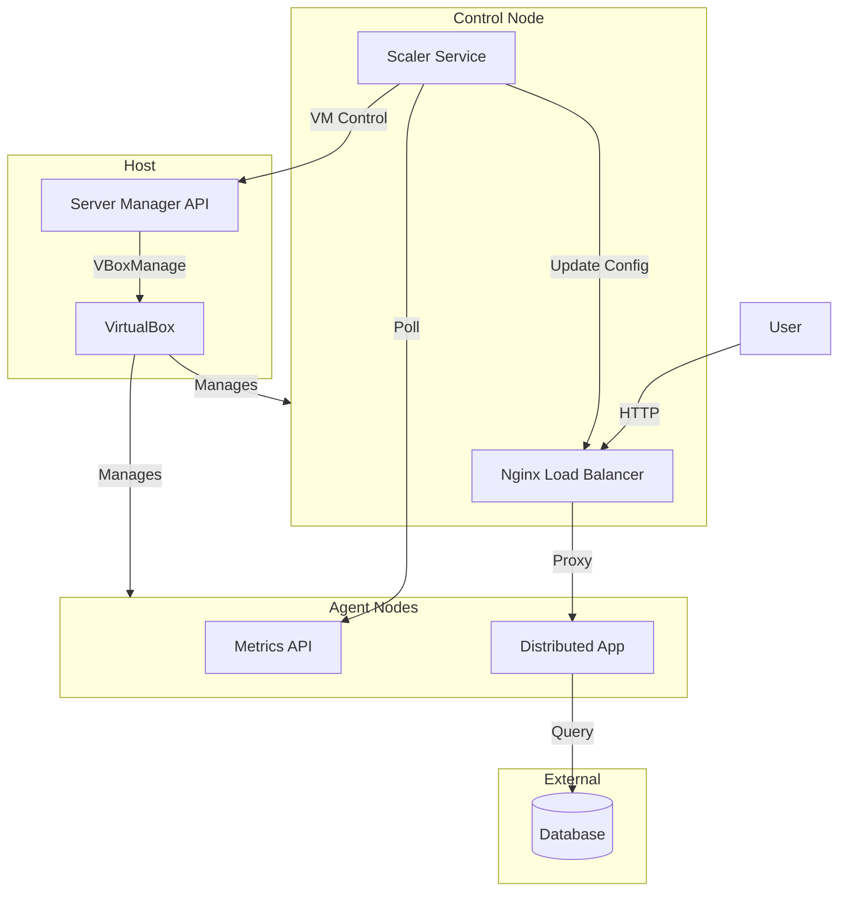

# Components

This document provides detailed descriptions of each component in the Cluster Operations Playground system.

## Host Layer Components

### VirtualBox

**Purpose:** Provides the virtualization platform for running multiple Ubuntu VMs on a single physical machine.

**Setup:** See [Host Setup Guide](../../infrastructure/host/host-setup.md)

### Server Manager API

**Purpose:** API for managing VirtualBox VMs, enabling automated scaling operations.

**Location:** `infrastructure/host/server-manager-api/`

**Key Features:**
- Power on/off VMs via HTTP requests
- Configurable server list via environment variables
- JSON response format

**How It Works:**
1. Receives HTTP requests to power VMs on/off
2. Executes `VBoxManage` commands to control VMs
3. Returns success/error responses

**Documentation:** [Server Manager API README](../../infrastructure/host/server-manager-api/README.md)

## Control Plane Components

### Nginx Load Balancer

**Purpose:** Distributes incoming HTTP traffic across multiple agent nodes for high availability and scalability.

**Location:** `infrastructure/nodes/2.control-node/control-node-setup.md` -> `Spin up load balancer` section

**Key Features:**
- Layer 7 (HTTP) load balancing
- Least-connections algorithm
- Dynamic configuration reloading without downtime

**Configuration Management:**
- Scaler updates upstream configuration when agents are added/removed
- Graceful reload preserves existing connections

**Traffic Flow:**
1. User sends HTTP request to port 8080 on host (forwarded to port 80 on control node)
2. Nginx selects agent with fewest active connections
3. Request proxied to selected agent
4. Response returned to user

**Setup:** See [Control Node Setup Guide](../../infrastructure/nodes/2.control-node/control-node-setup.md)

### Scaler Service

**Purpose:** Monitors agent node metrics and automatically scales the cluster up or down based on load.

**Location:** `infrastructure/nodes/2.control-node/scaler/`

**Key Features:**
- Metrics collection from all agent nodes
- CPU and memory threshold-based scaling decisions
- Automatic load balancer configuration updates
- SSH-based agent deployment

**Scale-Up Triggers:**
- CPU usage > 70% or Memory usage > 80%

**Scale-Down Triggers:**
- CPU usage < 30% and Memory usage < 40%

**Safety Mechanisms:**
- Minimum instance count (default: 1)
- Maximum instance count (configurable)
- Graceful connection draining before shutdown

**Operational Flow:**
1. Collect metrics from all agents every 10 seconds
2. Calculate average CPU and memory usage
3. Evaluate scaling rules
4. If scale-up needed:
   - Call Server Manager API to power on new VM
   - Wait for VM to boot and become healthy
   - Update Nginx upstream configuration
   - Reload Nginx
5. If scale-down needed:
   - Remove agent from Nginx configuration
   - Reload Nginx (stops new traffic)
   - Wait for connection drain (30s)
   - Call Server Manager API to power off VM

**Setup:** See [Control Node Setup Guide](../../infrastructure/nodes/2.control-node/control-node-setup.md)

## Worker Plane Components

### Metrics API

**Purpose:** Exposes real-time system metrics (CPU, memory) from each agent node for scaling decisions.

**Location:** `infrastructure/nodes/3.agent-nodes/metrics-api/`

**Key Features:**
- Lightweight and low overhead
- Real-time CPU and memory metrics

**How It Works:**
1. Exposes metrics via HTTP endpoint

**Setup:** See [Agent Node Setup Guide](../../infrastructure/nodes/3.agent-nodes/agent-node-setup.md)

### Distributed Application

**Purpose:** The actual business application deployed to agent nodes. Pluggable architecture allows any containerized application.

**Location:**
- `distributed-pluggable-api/`
- For environment variables configuration `infrastructure/nodes/2.control-node/scaler/pkg/deploy.go`

**Environment Configuration:** Scaler reads env vars set on Control Node, transfers them to each Agent Node (into .env file reciding in compose directory) during deployment (via deploy.go), which are then used by docker-compose. Depending on your distributed application, you may need to update environment variables that are passed to scaler and fix the deploy.go file to transfer the correct environment variables to the Agent Node.

**Deployment:**
- Deployed via Docker Compose on each agent node
- Containers managed by Docker daemon
- Automatic restart on failure

**Documentation:** See [Distributed API Documentation](../distributed-api/README.md)

## Component Interaction Summary

## Next Steps

- [Scaling Concepts](./scaling-concepts.md) - Learn about the scaling logic and how it works
