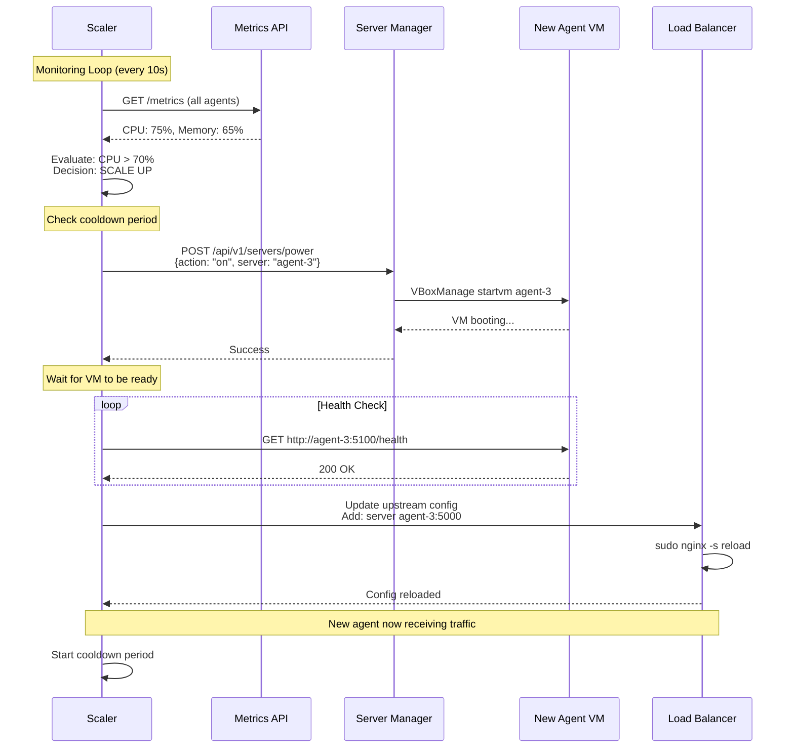
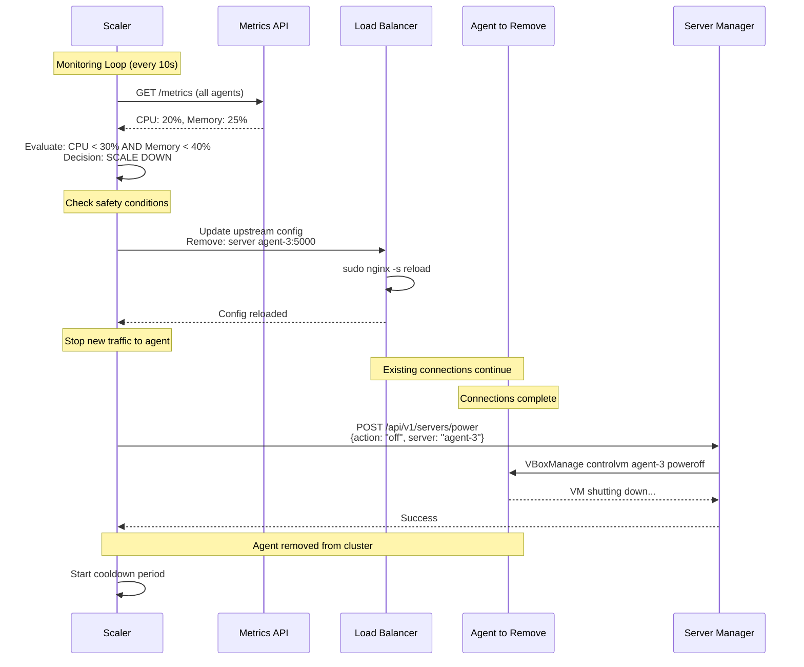

# Scaling Concepts

This document covers the auto-scaling design principles and decision-making logic used in the Cluster Operations Playground.

## Overview

The system implements **metrics-based horizontal auto-scaling** where agent nodes are dynamically added or removed based on real-time CPU and memory utilization. This approach balances resource efficiency with application performance.

## Core Principles

### 1. Metrics-Driven Decisions

Scaling decisions are based on objective, measurable metrics rather than manual intervention:

- **CPU Usage** - Primary indicator of compute load
- **Memory Usage** - Indicator of memory pressure
- **Threshold-Based** - Clear rules for when to scale

### 2. Stateless Architecture

Agent nodes are designed to be stateless, enabling seamless scaling:

- No local persistent data
- All state stored in external databases
- Nodes can be added/removed without data loss
- No coordination required between nodes

### 3. Gradual Scaling

The system scales incrementally to avoid overreaction:

- Add/remove one node at a time
- Cooldown periods between actions
- Prevents rapid oscillation (flapping)

### 4. Safety Mechanisms

Multiple safeguards ensure system stability:

- Minimum instance count (always at least 1 agent)
- Graceful connection draining before shutdown
- Health checks before adding nodes to pool

## Scaling Triggers

### Scale-Up Conditions

The system scales up when **any** of these conditions are met:

| Metric | Threshold  | Action |
|--------|-----------|--------|
| CPU Usage | > 70%  | Add 1 agent |
| Memory Usage | > 80% | Add 1 agent |

**Additional Checks:**
- Cooldown period elapsed
- Available VMs exist to power on

### Scale-Down Conditions

The system scales down when **all** of these conditions are met:

| Metric | Threshold  | Action |
|--------|-----------|--------|
| CPU Usage | < 30% | Remove 1 agent |
| Memory Usage | < 40% | Remove 1 agent |

**Additional Checks:**
- Current agent count > minimum required
- Cooldown period elapsed

## Scaling Flow

### Scale-Up Process



**Steps:**
1. **Detect High Load** - Metrics exceed thresholds
2. **Validate Conditions** - Check cooldown
3. **Power On VM** - Call Server Manager API
4. **Wait for Boot** - VM starts and services initialize
5. **Health Check** - Verify Metrics API is responding
6. **Update Load Balancer** - Add new upstream server
7. **Reload Nginx** - Gracefully apply new configuration
8. **Start Cooldown** - Prevent immediate re-scaling

### Scale-Down Process



**Steps:**
1. **Detect Low Load** - Metrics below thresholds for duration
2. **Validate Conditions** - Check cooldown, min instances
3. **Update Load Balancer** - Remove upstream server
4. **Reload Nginx** - Stop routing new traffic to agent
5. **Connection Drain** - Wait for existing requests to complete
6. **Power Off VM** - Call Server Manager API
7. **Start Cooldown** - Prevent immediate re-scaling

## Safety Mechanisms

### 1. Minimum Instance Count

**Purpose:** Ensure the application is always available

**Configuration:** Minimum 1 agent (configurable)

**Behavior:**
- System will never scale below minimum
- Even if metrics are very low
- Prevents complete service outage

## Metrics Collection

### Collection Frequency

- **Interval:** Every 10 seconds
- **Method:** HTTP GET to `/metrics` endpoint on each agent
- **Aggregation:** Average across all agents

### Decision Calculation

```
Agent 1: CPU 60%, Memory 55%
Agent 2: CPU 80%, Memory 70%
Agent 3: CPU 75%, Memory 65%

Average CPU:    (60 + 80 + 75) / 3 = 71.67%
Average Memory: (55 + 70 + 65) / 3 = 63.33%

CPU > 70% threshold? YES -> SCALE UP
```

## Design Rationale

### Why Metrics-Based Scaling?

**Alternatives Considered:**
- **Time-based:** Scale at specific times (e.g., business hours)
  - ❌ Doesn't adapt to actual load
  - ❌ Wastes resources during low traffic

- **Request-based:** Scale based on request rate
  - ❌ Doesn't account for request complexity
  - ❌ High request rate doesn't always mean high load

- **Metrics-based:** Scale based on CPU/memory usage
  - ✅ Directly measures actual resource consumption
  - ✅ Adapts to any workload pattern
  - ✅ Simple to understand and configure

### Why Least-Connections Load Balancing?

**Alternatives Considered:**
- **Round-robin:** Distribute requests evenly
  - ❌ Doesn't account for request duration
  - ❌ Can overload slow agents

- **IP Hash:** Route same client to same server
  - ❌ Requires sticky sessions
  - ❌ Defeats purpose of stateless design

- **Least-connections:** Route to agent with fewest active connections
  - ✅ Balances load based on actual work
  - ✅ Works well with varying request durations

### Why External Databases?

**Alternatives Considered:**
- **Database on VMs:** Run PostgreSQL/Redis on agent nodes
  - ❌ Complex replication setup
  - ❌ Data loss risk during scale-down
  - ❌ Requires coordination between nodes

- **External managed services:** Use hosted databases
  - ✅ Simplified infrastructure
  - ✅ Professional management and backups
  - ✅ Enables true stateless agents

## Monitoring and Observability

### Key Metrics to Monitor

1. **Scaling Events**
   - Scale-up count per hour/day
   - Scale-down count per hour/day
   - Average cluster size over time

2. **Performance Metrics**
   - Time to scale up
   - Time to scale down
   - Metrics collection latency

3. **Health Metrics**
   - Failed scale attempts
   - Unhealthy agents
   - Load balancer errors

## Best Practices

### Threshold Tuning

1. **Start Conservative**
   - Higher scale-up threshold (70-80%)
   - Lower scale-down threshold (20-30%)
   - Prevents over-provisioning

2. **Monitor and Adjust**
   - Track scaling frequency
   - Observe application performance
   - Adjust thresholds based on patterns

3. **Consider Application Characteristics**
   - CPU-intensive apps: Lower CPU threshold
   - Memory-intensive apps: Lower memory threshold
   - Bursty traffic: Shorter cooldown periods

### Capacity Planning

1. **Host Resources**
   - Ensure host can support maximum VMs
   - Leave headroom for host OS

2. **VM Sizing**
   - Right-size VMs for workload
   - Balance between too small (frequent scaling) and too large (waste)

3. **Database Capacity**
   - External databases must handle max load
   - Connection pooling configured properly
   - Monitor database metrics

## Next Steps

- [Distributed API Introduction](../distributed-api/README.md) - Learn about the distributed API and how it works, how you can integrate your application with it
