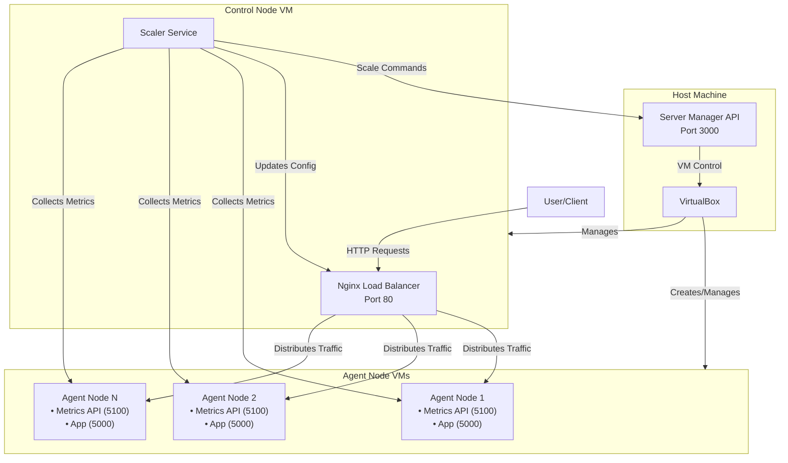
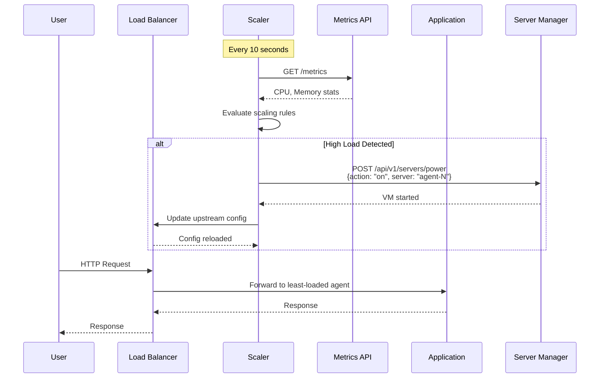
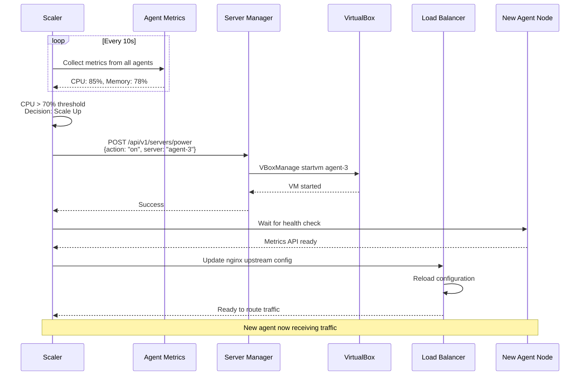
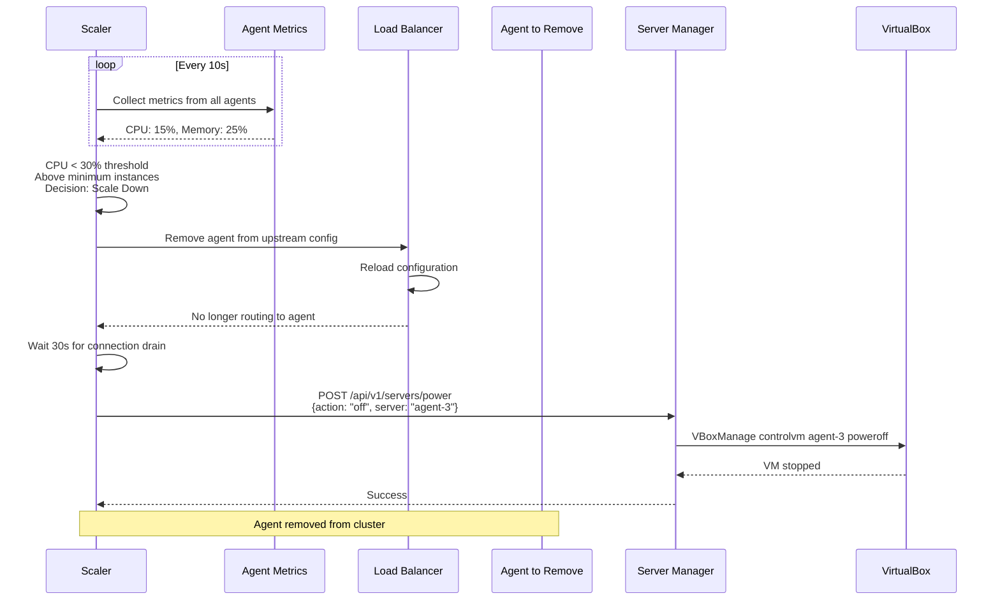
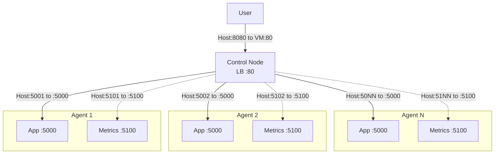

# System Architecture

This document provides details on how components interact to create a distributed, auto-scaling environment.

## High-Level Architecture

The system consists of three main layers:

1. **Host Layer** - Manages the virtualization infrastructure
2. **Control Plane** - Orchestrates load balancing and scaling
3. **Worker Plane** - Runs the distributed application




## System Topology

### Network Architecture

All VMs are connected through VirtualBox's network configuration:

- **Host Machine** - Runs VirtualBox and Server Manager API
- **Control Node** - Static VM, always running
  - Port 80 (forwarded to host 8080) - Load Balancer
  - Port 22 (forwarded to host 2223) - SSH
- **Agent Nodes** - Dynamic VMs, scaled on demand
  - Port 5000 (forwarded to host 5001, 5002, ...) - Application API
  - Port 5100 (forwarded to host 5101, 5102, ...) - Metrics API
  - Port 22 (forwarded to host 2224, 2225, ...) - SSH

### Component Communication



## Request Flow

### Normal Request Handling

1. **User sends HTTP request** to the load balancer (port 8080 on host, forwarded to port 80 on control node)
2. **Nginx Load Balancer** receives the request and selects an agent node using least-connections algorithm
3. **Agent Node** processes the request through the distributed application
4. **Response flows back** through the load balancer to the user

### Auto-Scaling Flow

#### Scale-Up Scenario



#### Scale-Down Scenario



## Data Flow

### Metrics Collection

```
┌─────────────┐
│   Scaler    │
│ (Control)   │
└──────┬──────┘
       │
       │ HTTP GET /metrics (every 30s)
       │
       ├──────────────┬──────────────┬──────────────┐
       │              │              │              │
       ▼              ▼              ▼              ▼
┌────────────┐ ┌────────────┐ ┌────────────┐ ┌────────────┐
│ Metrics API│ │ Metrics API│ │ Metrics API│ │ Metrics API│
│  Agent 1   │ │  Agent 2   │ │  Agent 3   │ │  Agent N   │
└────────────┘ └────────────┘ └────────────┘ └────────────┘
       │              │              │              │
       │              │              │              │
       └──────────────┴──────────────┴──────────────┘
                      │
                      ▼
            {
              "cpu": 45.2,
              "memory": {
                "total": 8589934592,
                "available": 4294967296,
                "percent": 50.0
              },
              "status": "active"
            }
```

### Application Traffic

```
┌──────────┐
│   User   │
└────┬─────┘
     │
     │ HTTP Request
     ▼
┌─────────────────┐
│ Nginx Load      │
│ Balancer        │
│ (Control Node)  │
└────┬────────────┘
     │
     │ Least Connections Algorithm
     │
     ├──────────────┬──────────────┬──────────────┐
     │              │              │              │
     ▼              ▼              ▼              ▼
┌──────────┐  ┌──────────┐  ┌──────────┐  ┌──────────┐
│ App:5000 │  │ App:5000 │  │ App:5000 │  │ App:5000 │
│ Agent 1  │  │ Agent 2  │  │ Agent 3  │  │ Agent N  │
└──────────┘  └──────────┘  └──────────┘  └──────────┘
     │              │              │              │
     └──────────────┴──────────────┴──────────────┘
                    │
                    ▼
          External Services
          (PostgreSQL, Redis)
```

## Component Responsibilities

### Host Layer

**VirtualBox**
- Provides virtualization platform
- Manages VM lifecycle

**Server Manager API**
- Exposes API for VM control
- Executes VBoxManage commands
- Provides VM status information

### Control Plane

**Nginx Load Balancer**
- Receives all incoming HTTP traffic
- Distributes requests using least-connections algo
- Dynamically reloads configuration without downtime

**Scaler Service**
- Monitors agent metrics every 10 seconds
- Evaluates scaling rules based on CPU/memory thresholds
- Triggers scale-up/down actions via Server Manager API
- Updates load balancer configuration dynamically
- Maintains minimum and maximum instance counts

### Worker Plane

**Metrics API**
- Exposes system metrics (CPU, memory)

**Distributed Application**
- Runs in containers on each agent

## Deployment Architecture

### VM Configuration

| VM Type | Count | Always Running | Purpose |
|---------|-------|----------------|---------|
| Control Node | 1 | Yes | Load balancing and orchestration |
| Agent Node | 2-N | Dynamic | Application workload |

### Port Mapping

**Control Node:**
```
Host:8080 -> VM:80   (Load Balancer)
Host:2223 -> VM:22   (SSH)
```

**Agent Nodes:**
```
Host:5001 -> Agent1:5000  (Application)
Host:5101 -> Agent1:5100  (Metrics)
Host:2224 -> Agent1:22    (SSH)

Host:5002 -> Agent2:5000  (Application)
Host:5102 -> Agent2:5100  (Metrics)
Host:2225 -> Agent2:22    (SSH)

... and so on for additional agents
```

**Visual Representation:**


## Security Considerations

### SSH Key Authentication
- Password authentication disabled
- All inter-node communication uses SSH keys
- Control node has SSH access to all agent nodes

### Network Isolation
- VMs communicate through VirtualBox internal network
- Only necessary ports exposed to host machine
- Firewall rules configured on each VM

### Service Security
- All services run as non-root users
- Docker containers use non-root user
- Minimal attack surface with Alpine-based images

## Scalability Characteristics

### Horizontal Scaling
- Agent nodes can be added/removed dynamically
- No theoretical limit on agent count

## Next Steps

- [Components](./components.md) - Learn about the components and their roles in the architecture.
