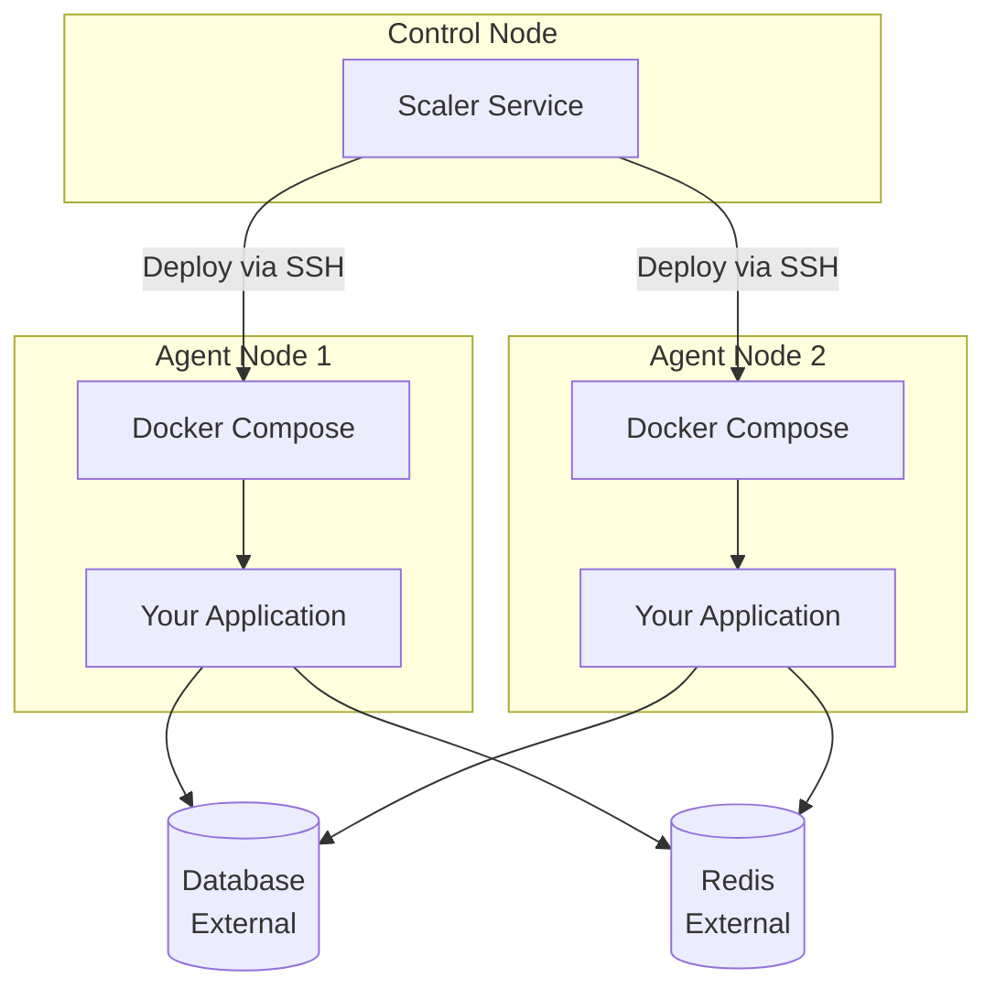
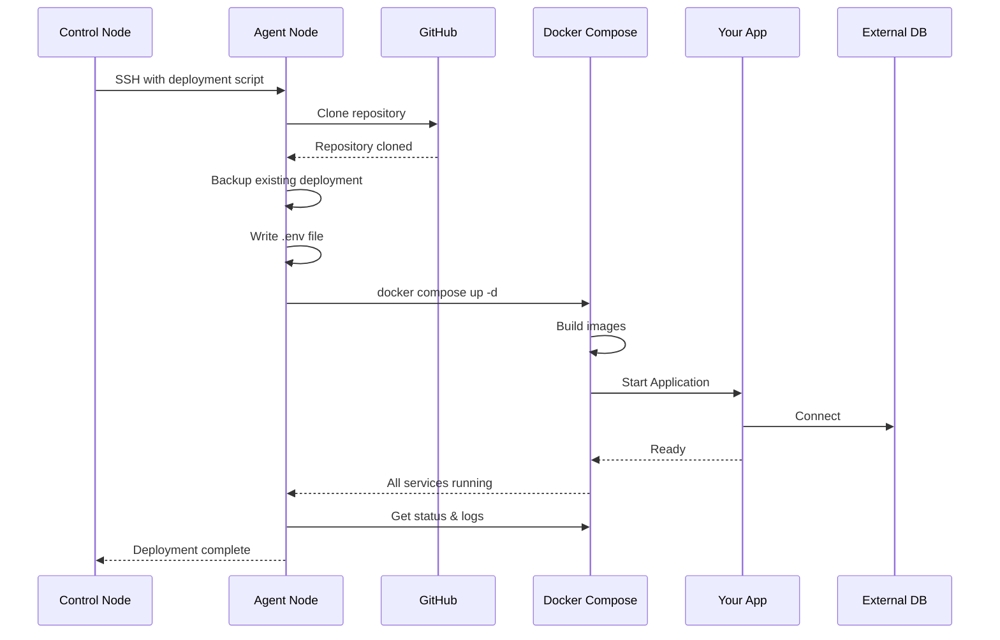

# Deployment

This document explains how your stateless application is deployed to agent nodes in the Cluster Operations Playground.

## Deployment Overview

The deployment is **fully automated** by the control node's scaler service. The process is orchestrated by the `DeployPluggableAPI` function in [`deploy.go`](../../infrastructure/nodes/2.control-node/scaler/pkg/deploy/deploy.go), which executes a remote bash script on each agent node via SSH.

**Key Steps:**
1. **Clones the repository** - Fetches the latest code from GitHub
2. **Prepares the deployment directory** - Creates backup of existing deployment
3. **Configures environment** - Writes `.env` file with connection strings
4. **Installs dependencies** - Ensures Git, Docker, and Docker Compose are available
5. **Builds and starts services** - Runs `docker compose up -d` to build and start containers
6. **Verifies deployment** - Shows container status and recent logs

### Deployment Architecture



### Deployment Sequence



## Configuration

Environment variables are securely transmitted from the control node to the agents:

1. Read from control node environment
2. Base64 encoded for safe transport
3. Decoded on agent and written to a `.env` file
4. `.env` file is secured with `chmod 600`

## Deployment Process Details

### 1. Directory Structure
On each agent node, the deployment creates the following structure (defaults defined in `deploy.go`):

```
~/pluggable-api/
├── your-repo-name/
│   └── path-to-compose
│       ├── docker-compose.yml
│       └── .env
```

### 2. Automated Dependency Installation
The script automatically installs necessary tools on Ubuntu/Debian agents if they are missing:
*   **Git**: For cloning the repository.
*   **Docker CE & Compose Plugin**: For running the application.

### 3. Safety Mechanisms
*   **Atomic Replacement**: New code is cloned to a temporary location first.
*   **Backups**: The existing deployment is backed up before being replaced.
*   **Rollback**: If the new deployment fails to start, the backup is automatically restored.
*   **Path Safety**: The script ensures it only operates within the user's home directory.

## Docker Compose Configuration

Your application logic is defined entirely in your `docker-compose.yml`. The deployment script simply runs `docker compose up -d` on this file. You can learn more about this in next section (Docker Setup).

## Next Steps

- [Docker Setup](./docker-setup.md) - Learn more about preparing your Docker environment.
