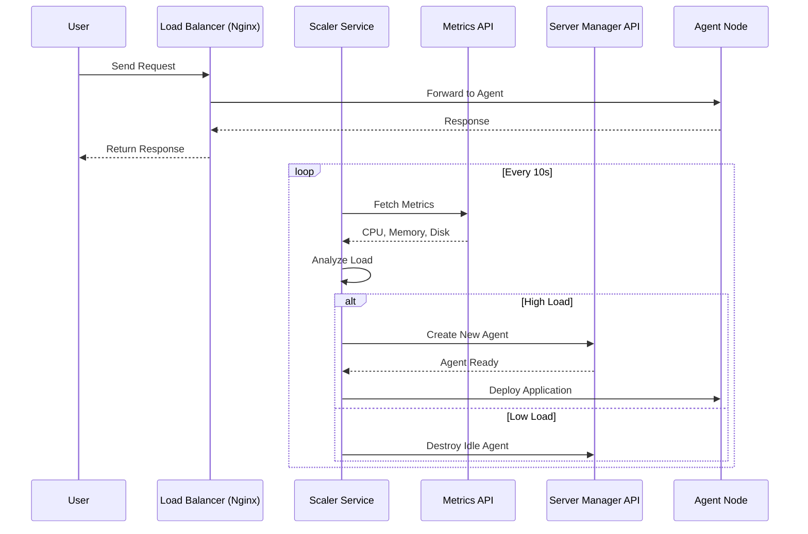

# Infrastructure Setup

This directory contains everything you need to set up and manage the infrastructure for the Cluster Operations Playground. Since most of us don't have a rack of servers lying around, we're simulating a real cluster using VMs on your local machine.

## The Host Machine

Your "host" is just your physical computer - the one running VirtualBox or whatever virtualization software you're using.

### Why do we need a host?

Simple: we need multiple "servers" to create a realistic cluster. Instead of buying actual hardware, we spin up VMs that act like separate machines. Your host manages all of these VMs.

### Server Manager API

You'll find this in [`host/server-manager-api`](./host/server-manager-api/). It's a small service that runs on your host machine and gives you an API to control your VMs programmatically.

What it does:
- Spins up and tears down VMs
- Handles network configuration
- Keeps track of which VMs are running
- Acts as the bridge between your control node and VirtualBox

## How the Cluster is Organized

Your cluster has two types of nodes:

### Control Node (Always Running)

This is the brain of your cluster. It's always on and handles orchestration.

What runs here:
- **Nginx** - Load balancer that distributes incoming requests across your agent nodes
- **Scaler** - Watches metrics and decides when to spin up or shut down agents
- Deployment logic for pushing your app to agents

Think of it as mission control.

**Setup guide:** [`nodes/2.control-node/`](./nodes/2.control-node/)

### Agent Nodes (Dynamic)

These are your worker nodes. They come and go based on demand.

What runs here:
- **Your application** - Deployed via Docker Compose
- **Metrics API** - Reports CPU, memory, and disk usage back to the scaler

The scaler will create more agents when traffic is high and destroy them when things are quiet.

**Setup guide:** [`nodes/3.agent-nodes/`](./nodes/3.agent-nodes/)

## All the Pieces

Here's what goes where:

| What | Where | Runs On | Why |
|------|-------|---------|-----|
| Server Manager API | `host/server-manager-api/` | Your computer | Creates/destroys VMs |
| Nginx | Control node | Control VM | Routes traffic to agents |
| Scaler | `nodes/2.control-node/scaler/` | Control VM | Decides when to scale |
| Metrics API | `nodes/3.agent-nodes/metrics-api/` | Each agent | Reports system stats |
| Your app | Deployed by scaler | Each agent | Whatever you're building |

## How It All Works

Here's what happens when a user hits your app, and how the scaler keeps things balanced:

User requests flow through Nginx to your agents. Meanwhile, the scaler is constantly checking metrics and adjusting capacity.

## Setup Order

Do these in order, or things won't work:

1. **[Base Setup](./nodes/1.base-setup/)** - Create your VMs and get SSH working
2. **[Control Node](./nodes/2.control-node/)** - Set up Nginx and the scaler
3. **[Agent Nodes](./nodes/3.agent-nodes/)** - Install the metrics API
4. **[Deploy Your App](../docs/distributed-api/deployment.md)** - Get your application running

## Where to Go Next

- New here? Read the [Project README](../docs/README.md) first
- Ready to build? Start with [Base Setup](./nodes/1.base-setup/README.md)
