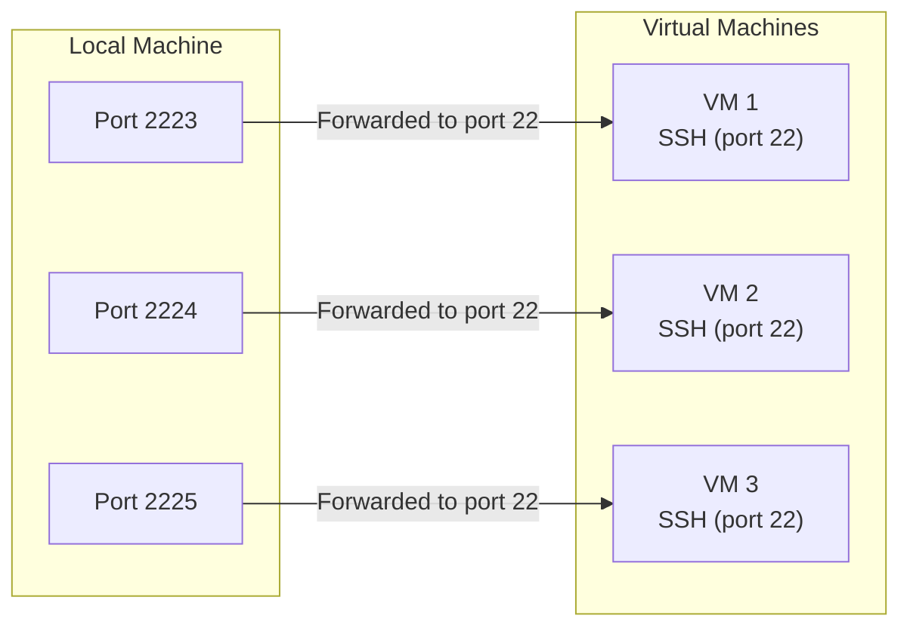

# Ubuntu Base Setup

If you don't have real servers available, you can create virtual ones.

## Create Virtual Servers

1. Install **VirtualBox**
2. Download **Ubuntu ISO**
3. Create VMs for:
   * `control-node`
   * `agent-node-one`, `agent-node-two`, etc.

### Port Forwarding

Our local machine itself can only have one service bound to a given port - meaning you can't directly expose port 22 from multiple VMs at once. To solve this, we use port forwarding. This maps a unique port on the host (for example, 2223, 2224, 2225) to port 22 inside each VM.



#### Configure Port Forwarding

1. VM Settings -> **Network -> Advanced -> Port Forwarding**
2. Add a new rule:
   * Protocol: `TCP`
   * Host Port: `2223`
   * Guest Port: `22`
   * Guest IP: *(leave blank)*

### SSH Setup

Install and enable SSH

```bash
sudo apt update && sudo apt upgrade -y
sudo apt install openssh-server -y
sudo systemctl enable --now ssh
sudo systemctl status ssh
```

Configure the firewall to allow SSH connections:

```bash
sudo ufw allow ssh
sudo ufw enable
sudo ufw status
```

Test SSH from Your Local Machine

Replace:
* `<port_number>` -> with the SSH port of the target server (e.g., `2223`)
* `<user>` -> with the username on the target server (e.g., `ubuntu`)
* `<server_ip>` -> with the IP address of the target server (e.g., `192.168.1.101`)

```bash
ssh -p <port_number> <user>@<server_ip>
```

If it connects successfully, your SSH server is ready.

#### Configure SSH Key Authentication

- Generate an SSH key (once, on your local machine)
- Copy public key to each of your Ubuntu servers
- Disable password login for better security
- Test connections

**Generate SSH Key (On Your Local Machine)**

```bash
mkdir $(pwd)/.ssh
chmod 700 $(pwd)/.ssh
ssh-keygen -t ed25519 -f $(pwd)/.ssh/id_ed25519
```

**Copy Public Key to Each Server**

Replace:
* `<port_number>` -> with the SSH port of the target server (e.g., `2223`)
* `<user>` -> with the username on the target server (e.g., `ubuntu`)
* `<server_ip>` -> with the IP address of the target server (e.g., `192.168.1.101`)

Copy the public key to the target server:

```bash
ssh-copy-id -i $(pwd)/.ssh/id_ed25519.pub -p <port_number> <user>@<server_ip>
```

**Test Key-Based Login**

```bash
ssh -i $(pwd)/.ssh/id_ed25519 -p <port_number> <user>@<server_ip>
```

##### Harden SSH Configuration

To disable password login, you need to edit the sshd_config file on each node:

```bash
sudo nano /etc/ssh/sshd_config
```

Ensure the following lines are present with the values shown (make sure they don't have a # in front of them):

```
PubkeyAuthentication yes
PasswordAuthentication no
```

Restart SSH:

```bash
sudo systemctl restart sshd
```

### Passwordless Sudo Privileges

A password for `sudo` is a critical security layer. However, for a **development playground** (where we are mimicking real servers with virtual machines, changing the protected files and directories in automated processes), entering passwords manually is impractical.

Setting up passwordless sudo allows processes to run as `sudo` without manual intervention.

> [!WARNING]
> **Security Risk**: Granting passwordless sudo access means any process running as that user can execute administrative commands. Only use this in trusted development environments.

Run the following commands on each server. Replace `<username>` with your actual username (e.g., `ubuntu`).

```bash
echo "$USER ALL=(ALL) NOPASSWD:ALL" | sudo tee /etc/sudoers.d/$USER-nopasswd

sudo chmod 440 /etc/sudoers.d/$USER-nopasswd
```

To confirm it works, try running a command with `sudo`. It should return your username immediately without asking for a password:

```bash
sudo whoami
```

**Revoke Access (If Needed)**

If you wish to restore standard security later, simply remove the override file:

```bash
sudo rm /etc/sudoers.d/$USER-nopasswd
```
