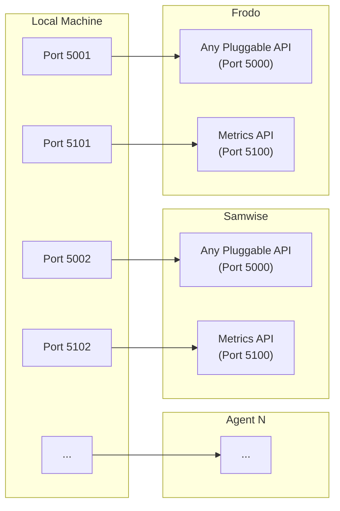

# Agent Node (Ubuntu Server) Setup

After completing the [Base Setup](../1.base-setup/base-setup.md), we need to configure each **Agent Node** so that the Control Node can manage them automatically.

## Firewall Configuration

The firewall on the Agent Node might be blocking the connections.

### Metrics API

You need to allow traffic on port `5100`.
**Note:** The `setup-metrics-api.sh` script (which we'll run later) handles this automatically.

```bash
sudo ufw allow 5100/tcp
sudo ufw reload
```

### Any Pluggable API

You need to allow traffic on port `5000`. Run this on each Agent Node:

```bash
sudo ufw allow 5000/tcp
sudo ufw reload
```

## Expose the Port / Forward the Port

Since the APIs will run inside the VM, we need to forward a port from our local machine to access it.



### Metrics API

Since the Metrics API will run on port `5100` inside the VM, we need to forward a port from our local machine to access it.

We will map:
*   **Agent 1**: Host Port `5101` -> Guest Port `5100`
*   **Agent 2**: Host Port `5102` -> Guest Port `5100`
*   Repeat for each agent node

1.  Open VirtualBox and select your Agent Node VM.
2.  Go to **Settings** -> **Network** -> **Adapter 1** -> **Advanced** -> **Port Forwarding**.
3.  Add a new rule:
    *   **Name**: `metrics-api`
    *   **Protocol**: `TCP`
    *   **Host Port**: `5101` (different for each agent node)
    *   **Guest Port**: `5100` (same for all agent nodes)
    *   **Guest IP**: *(leave blank)*

Now you can test the API from your local machine:

```bash
curl http://192.168.1.8:5101/health
```

### Any Pluggable API

Since the Any Pluggable API will run on port `5000` (assumption and true for our example project) inside the VM, we need to forward a port from our local machine to access it.

We will map:
*   **Agent 1**: Host Port `5001` -> Guest Port `5000`
*   **Agent 2**: Host Port `5002` -> Guest Port `5000`
*   Repeat for each agent node


1.  Open VirtualBox and select your Agent Node VM.
2.  Go to **Settings** -> **Network** -> **Adapter 1** -> **Advanced** -> **Port Forwarding**.
3.  Add a new rule:
    *   **Name**: `pluggable-api`
    *   **Protocol**: `TCP`
    *   **Host Port**: `5001` (different for each agent node)
    *   **Guest Port**: `5000` (same for all agent nodes)
    *   **Guest IP**: *(leave blank)*

Now you can test the API from your local machine:

```bash
curl http://192.168.1.8:5001/
```

## Spin Up Metrics Api

The Metrics API runs on each Agent Node and exposes real-time system metrics (CPU, Memory) so the Control Node can make scaling decisions.

### Build the Metrics API Binary

From your **local machine**, build the binary:

Since the Control Node is Linux (and running on ARM64/aarch64), you need to cross-compile for that architecture:

```bash
# Build the binary for Linux ARM64
GOOS=linux GOARCH=arm64 make build

# OR Build the binary for Linux x86_64
GOOS=linux GOARCH=amd64 make build
```

### Copy the API Binary & Setup Script

Create a directory `app` on the agent node:

```bash
ssh -i <path/to/private_ssh_key> -p <port_number> <user>@<server_ip> "mkdir -p /home/<user>/app"
```

From your **local machine**, copy the binary, the setup script, and the environment example to the Agent Node:

```bash
scp -i <path/to/private_ssh_key> -P <port_number> \
    infrastructure/nodes/3.agent-nodes/metrics-api/metrics-api \
    infrastructure/nodes/3.agent-nodes/setup-metrics-api.sh \
    infrastructure/nodes/3.agent-nodes/metrics-api/.env.example \
    <user>@<server_ip>:/home/<user>/app/
```

### Configure Metrics API

SSH into the Agent Node and navigate to the app directory:

```bash
cd /home/<user>/app
```

Create a `.env` file based on the example:

```bash
cp .env.example .env
```

If you need to change the port (default is 5100), edit the `.env` file:

```bash
nano .env
```

### Setup Metrics API

Run the setup script to install and start the Metrics API as a systemd service:

```bash
chmod +x setup-metrics-api.sh
./setup-metrics-api.sh
```

Check the status to ensure it's running:

```bash
sudo systemctl status metrics-api
```
